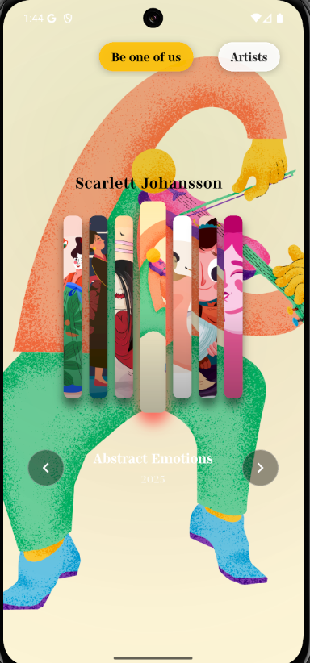
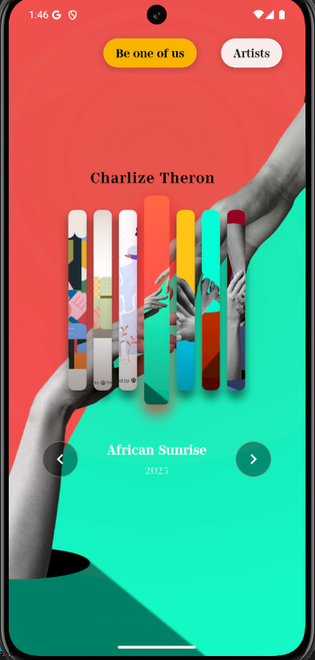
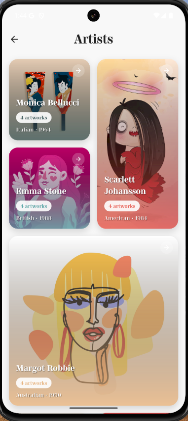
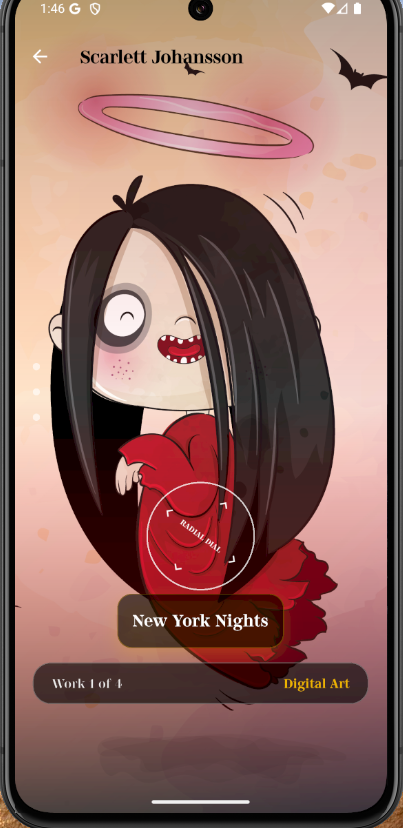

# 🎨 Flutter Art Gallery App

A Flutter application designed to showcase artworks by artists with dual interfaces: one for visitors to explore, and another for artists to manage their own content. This project demonstrates architectural best practices and efficient performance for a mobile-first experience.

---

###  **video demo **

 | 


## 📱 Screenshots

|  | |  |  |

 | 

## 🌟 Features

- 🔁 **Dual Interface:** Visitor view and Artist dashboard
- 🗃️ **Local Storage:** Artist data stored using Hive
- 🧠 **State Management:** Implemented with Riverpod
- 🏗️ **Clean Architecture:** Clear separation between presentation, domain, and data layers
- 📱 **Responsive UI:** Mobile-first design with reusable widgets

---

## 🗂️ Project Structure

```plaintext
/lib
├── main.dart
├── localization/         # Language files
├── router/               # GoRouter config
├── screens/              # UI screens for artist & visitor
├── models/               # Data models (artwork, user, etc.)
├── services/             # Local DB, media upload, etc.
├── widgets/              # Reusable UI components
└── utils/                # Helpers and constants
```

---

## 🚀 Branch Strategy

This repository uses a feature-based branch strategy:

| Branch Name             | Description |
|-------------------------|-------------|
| `main`                 | Production-ready code |
| `dev`                  | Development integration branch |
| `feature/i18n`         | Implementation of multilingual support |
| `feature/cloud_upload` | Cloudinary image/video integration |
| `feature/local_db`     | Local database with Hive |
| `feature/architecture` | Project setup & folder structure |

Each feature branch includes its own README file detailing:
- What was implemented
- Why it was chosen
- How it works

---


## 🗃️ Local DB (feature/local_db)
Hive is used to store artist and artwork data locally.

### Why Hive?
- Lightweight & NoSQL
- Fast read/write
- Works without internet

---

## 🧠 Architecture (feature/architecture)
Clean Architecture is used to keep code modular and scalable.

### Benefits:
- Easy testing
- Separation of concerns
- Reusable components

---

## 🛠️ Getting Started

```bash
flutter pub get
flutter run
```

---

## 📸 Screenshots
*Coming soon*

---

## 📄 License
MIT
